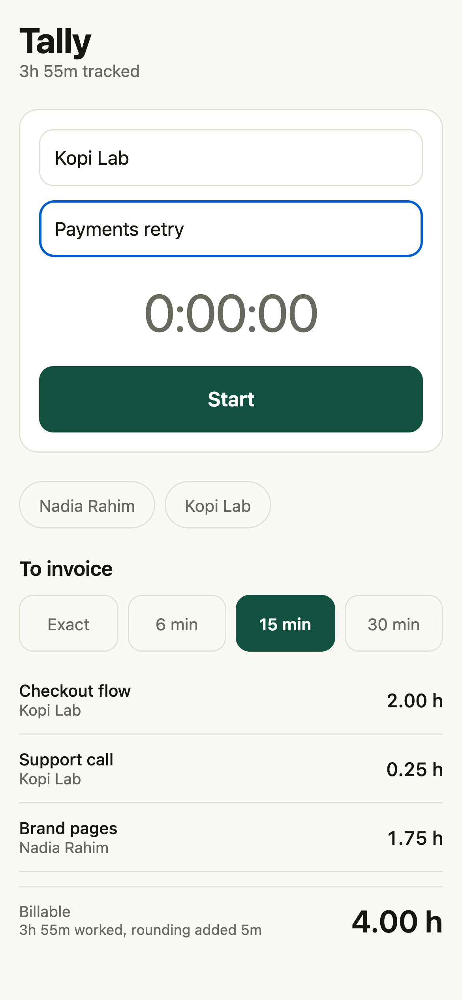
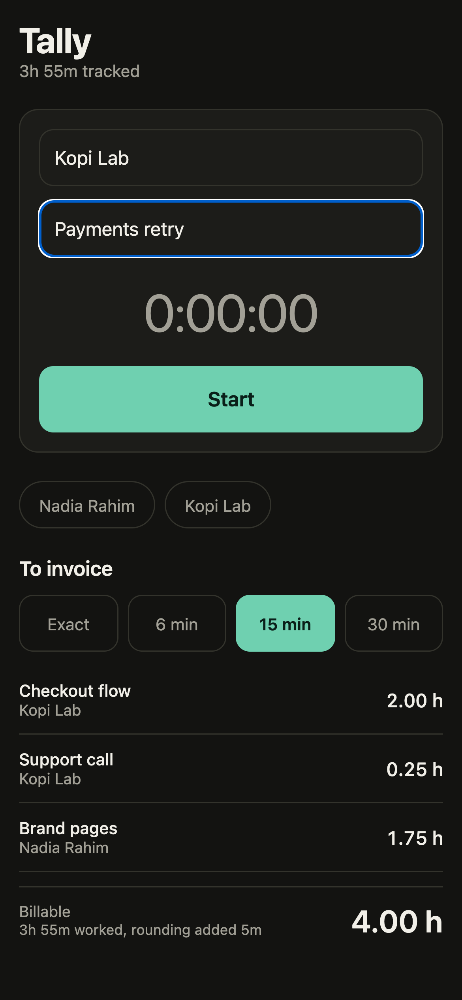

# Tally

Freelance time tracking whose output is invoice lines.

<p>
  
  
</p>

React Native, Expo, TypeScript.

## Rounding happens once

This is the whole reason it exists.

Freelancers bill in blocks — six minutes, fifteen, thirty. The convention is to
round **up**. The question nobody asks is *up from what*.

Round each sitting and four five-minute check-ins on one task bill as **one
hour**. Round the task total and the same twenty minutes bills as **thirty
minutes**. Rounding up is the convention; doing it four times over is not the
convention, it is an error that happens to favour whoever is sending the
invoice.

So entries are grouped by client and task, and the increment is applied once to
the group. There is a test for exactly that case.

The unrounded total is shown beside the billed one whenever they differ —
*"3h 55m worked, rounding added 5m"*. Rounding up is normal, but the person
sending the invoice should see the size of what it added rather than find out
when a client asks.

## Grouped the way a client reads it

Three separate sittings on the same task are one line. A client looking at the
same task listed three times with different durations is being asked to audit
your day, which is not what they are paying for.

## The clock cannot drift

Elapsed time is derived from a start timestamp, not counted up by the interval.

A ticking counter loses time whenever the OS suspends the app or throttles
background timers — which is most of a working day — and the loss is silent and
always in the client's favour. The interval here only decides how often the
screen redraws; the number is always the difference between two clock readings.

## Smaller decisions

**Anything under a minute is discarded.** It is a mis-tap, not work, and once
rounded up it would bill for fifteen minutes.

**Recent clients are offered as chips**, most recently worked first, because
the same four names come up all week.

**Stored data is checked field by field, never cast.** The JSON on disk was
written by an older build, which is a different program. Trusting its shape is
how a rename three versions ago becomes a crash on launch that reinstalling
does not fix.

**A read that cannot be parsed returns an empty list rather than throwing.**
Losing the log is bad; refusing to open at all, so nothing new can be recorded
either, is worse.

## Running it

```bash
npm install
npx expo start
```

Press `i` for the iOS simulator, `a` for Android, `w` for the browser.

## Tests

```bash
npm test        # 14 tests over the billing arithmetic
npm run typecheck
```

The tests cover the pure logic — rounding direction, group-once rounding,
grouping rules, decimal hours, clock formatting and negative-duration guards.
They run under `node --test` with no test framework and no native toolchain,
which is why they run anywhere.

## Licence

MIT
